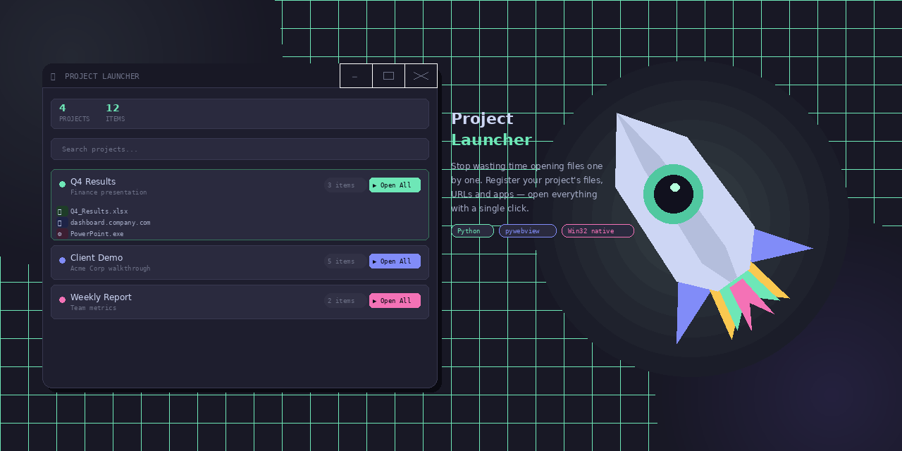

# 🚀 Project Launcher




> A minimal desktop app to manage and launch all files, programs and browser tabs of a project with a single click.

---

## 🎯 The Problem

Anyone who juggles multiple projects knows the drill: it's time to present your work and you need to open the Excel sheet, the PDF report, the Google Sheets dashboard, the internal system and two more browser tabs — all manually, one window at a time.

**Project Launcher solves that.**

Register once which files, programs and URLs belong to each project. When it's time to present, hit **▶ Open All** and let the app handle the rest.

---

## ✨ Features

- **Full CRUD for projects** — create, edit and delete projects with custom name, description and color
- **3 item types per project:**
  - 📄 **Files** — any local file (Excel, PDF, Word, images, etc.)
  - 🌐 **URLs** — Google Sheets links, dashboards, web apps, anything with an address
  - ⚙️ **Programs** — executables and installed applications
- **▶ Open All** — launches every item in the project at once with a single click
- **Real-time search** — filters projects by name or description as you type
- **Local data persistence** — everything saved as JSON next to the executable, no server, no database, no account
- **Modern dark UI** — VSCode-inspired dark theme with custom titlebar and app icon
- **Native Windows window** — resizable from all edges and corners, draggable titlebar, native minimize/maximize/close buttons

---

## 🖥️ Interface

The UI is built with plain HTML/CSS/JS running inside a native window via **pywebview** — no external browser is ever opened. The titlebar is fully custom in VSCode dark style, with thin SVG buttons and a red hover state on close.

Window dragging and resizing work through native Windows calls via `ctypes`, sending the correct hit-tests (`HTCAPTION`, `HTLEFT`, `HTBOTTOMRIGHT`, etc.) directly to the OS — behavior is identical to any standard Win32 window, including snap-to-edge and all other native interactions.

---

## 🛠️ Tech Stack

| Technology | Purpose |
|---|---|
| **Python 3** | Backend, local HTTP server, business logic |
| **pywebview** | Native desktop window with embedded WebView |
| **Pillow** | Rocket icon `.ico` generation at multiple resolutions |
| **PyInstaller** | Packaging into a single standalone `.exe` |
| **HTML / CSS / JS** | Complete UI (no framework) |
| **ctypes (Win32)** | Native drag and resize for the frameless window |
| **http.server** | Local HTTP server for the internal REST API |

No Django. No Flask. No Electron. No Node. Just the Python standard library plus two packages.

---

## 📦 Installation & Usage

### Prerequisites

Python 3.8 or higher. Check with:

```bash
python --version
```

### Run directly with Python

```bash
pip install pywebview pillow
python project_launcher_app.py
```

### Build the `.exe`

Place all files in the same folder and double-click:

```
build.bat
```

The script installs dependencies, generates the icon and packages everything. The executable is created at `dist\Project Launcher.exe`. After the build, only the `.exe` is needed — copy it anywhere you want.

### File structure for the build

```
📁 your-folder/
├── project_launcher_app.py   # Main source
├── generate_icon.py          # Icon generator
├── icon.ico                  # Generated icon
└── build.bat                 # Build script
```

After the build, for daily use:

```
📁 anywhere/
├── Project Launcher.exe      # This is all you need
└── projects_data.json        # Auto-created on first run
```

---

## 🏗️ Architecture

The app runs as a single process:

```
┌─────────────────────────────────────────┐
│           Project Launcher.exe          │
│                                         │
│  ┌─────────────┐    ┌────────────────┐  │
│  │  pywebview  │◄──►│  HTTP Server   │  │
│  │  (window)   │    │  (localhost)   │  │
│  └─────────────┘    └───────┬────────┘  │
│         │                   │           │
│         │           ┌───────▼────────┐  │
│         │           │ projects_data  │  │
│         │           │    .json       │  │
│         │           └────────────────┘  │
│         │                               │
│  ┌──────▼──────────────────────────┐    │
│  │   HTML + CSS + JS  (full UI)    │    │
│  └─────────────────────────────────┘    │
└─────────────────────────────────────────┘
```

1. Python starts an HTTP server on `localhost` at a random available port
2. pywebview opens a native window pointing to that server
3. The UI makes REST calls to the internal API (`GET/POST/PUT/DELETE /api/projects`)
4. Python persists data as JSON and opens files/URLs/apps via `os.startfile` / `webbrowser`

---

## 📡 Internal API

| Method | Endpoint | Description |
|---|---|---|
| `GET` | `/api/projects` | List all projects |
| `POST` | `/api/projects` | Create a new project |
| `PUT` | `/api/projects/:id` | Edit name, description and color |
| `DELETE` | `/api/projects/:id` | Delete a project |
| `POST` | `/api/projects/:id/items` | Add an item to a project |
| `DELETE` | `/api/projects/:id/items/:idx` | Remove an item from a project |
| `POST` | `/api/projects/:id/launch` | Open all items in the project |

---

## 💡 Why I Built This

This project came from a real pain point: I work across many projects simultaneously and every time I needed to show results to someone, I'd spend minutes opening files and tabs manually — risking opening the wrong thing in front of a client.

I wanted something simple that ran entirely on my machine without depending on the internet or any cloud service, and that felt like a real app — not a webpage sitting in a browser tab.

The most interesting technical challenge was implementing window drag and resize without the native Windows border. The solution was to use `ctypes` to send `WM_NCLBUTTONDOWN` messages with the correct hit-test values directly to the operating system. Windows then takes over the move/resize interaction just as it would for any ordinary window — including screen edge snapping and other native behaviors — with no custom drag logic needed on the Python side.

---

## 🗺️ Roadmap

- [ ] Global keyboard shortcut to open the app
- [ ] macOS and Linux support
- [ ] Project sorting and grouping
- [ ] Import/export for backup
- [ ] Custom icon per project

---

<p align="center">
  Built with pure Python and a strong desire to stop opening tabs one by one.
</p>
